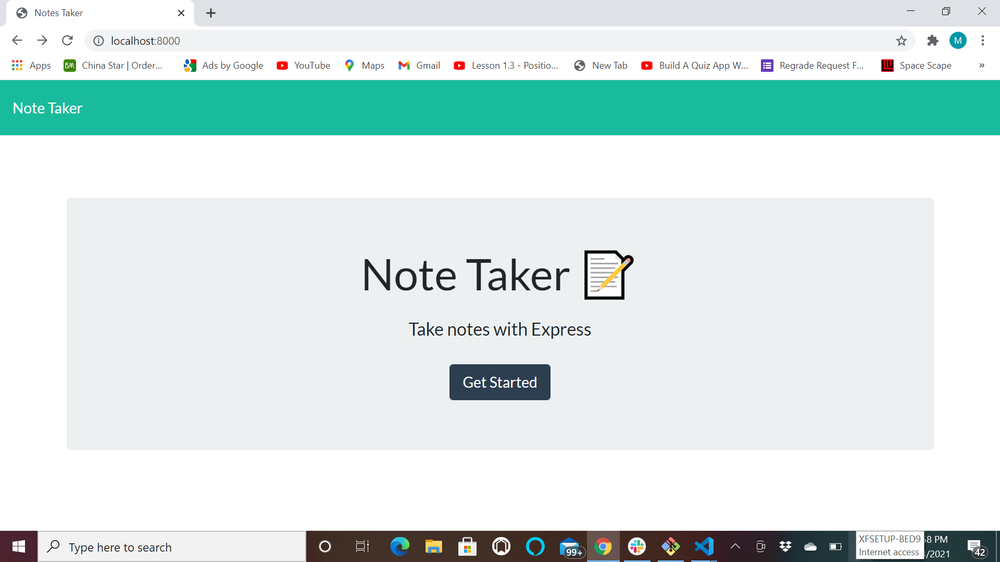
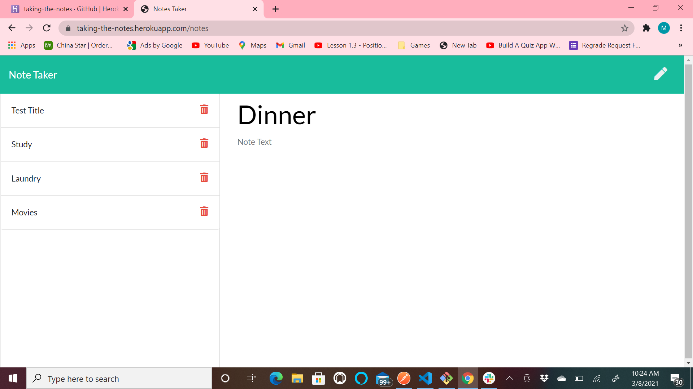

# Notes Taker

        
## Name:Mike Gordillo
## GitHub user name: GitHub.com/MikeGordillo

## Table of contents:  
* [Description](#description)
* [Installation](#Installation)
* [Usage](#usage)
* [License](#license)
* [Testing](#testing)
* [Questions](#questions)
        
## Description:
* This is a simple App to take, save and delete notes.
## Installation:
* npm i install express, then download files on this repository and run server.js
## Usage:
* simply run the server.js and connect to your local port, then App will display in the 
browser and will be ready to use.
## license:
* None
* ## Contributing:
* Yes, just fork repo and pull request for approval.
## Testing:
* no test
## Questions:
* Contact Mike Gordillo with any questions at mikegordillotattoo@gmail.com

https://github.com/MikeGordillo/Notes_Taker

https://taking-the-notes.herokuapp.com/